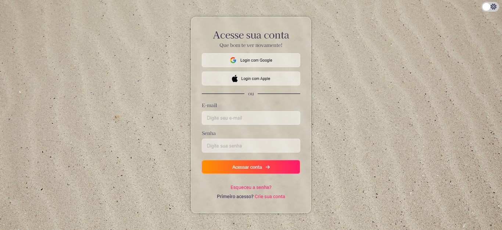

  

  <h3 align="center">Glass Effect</h3>

  

     Landing page com painéis de vidro em um fundo colorido.
        
     
    <a href="https://glass-effect-nicolycunha.netlify.app/">Projeto</a>
    ·
    <a href="https://www.linkedin.com/in/nicoly-oliveira-da-cunha/">Contato</a>
  

# Objetivo:
Este repositório foi criado com o objetivo de estudar sobre um efeito css, chamado Glassmorphism, que consiste em criar painéis parecidos com vidro por possuirem transparência.

# Techs utilizadas: 
VueJS 
Typescript 
CSS 

